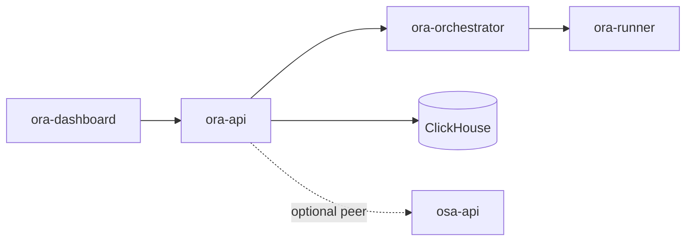

# Architecture

`ora-api` serves the Open Review Agent control plane. Long-running HTTP lives here; async review/git/coding work is scheduled by `ora-orchestrator` into ephemeral `ora-runner-*` containers.

Dashboards call only `ora-api`. Peer calls to OSA/OPA are server-side when configured.
