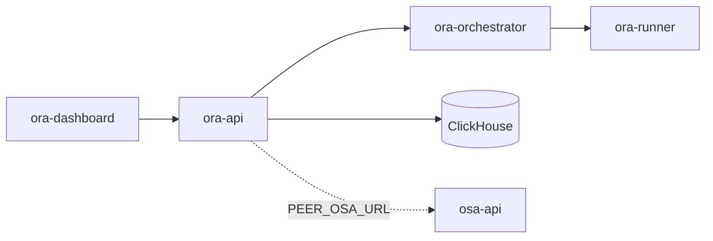

# Architecture

`ora-api` serves the Open Review Agent control plane. Long-running HTTP lives here; async review/git/coding work is scheduled by `ora-orchestrator` into ephemeral `ora-runner-*` containers (one container per job phase).

## Ownership

| Surface | Product |
|---------|---------|
| Repo Watch, SCM connectors/webhooks | ORA |
| Review jobs, review check-runs, coding agents | ORA |
| Review-provider settings, roadmaps | ORA |
| Security runs, AppSec findings, AppSec gate | **OSA** (peer) |

## Containers

| Image | Role |
|-------|------|
| `ora-api` | Control plane (`:8091`) |
| `ora-orchestrator` | Same binary, `orchestrator` command |
| `ora-runner-git` / `ora-runner-ai` / `ora-runner-php` | Ephemeral per phase |
| `ora-egress-proxy` | Allowlisted egress for review runners |

AppSec scan images (`osa-runner-scan`) live in **OSA-API**.

Image tags: `*:smoke` (laptop) · `*:nas` (production / NAS only).

## Optional micro-services (Phase 3)

Behind an optional `ora-gateway`: `ora-scm`, `ora-review`, `ora-agents`, `ora-ai`, `ora-roadmap`. See [microservices.md](microservices.md).
